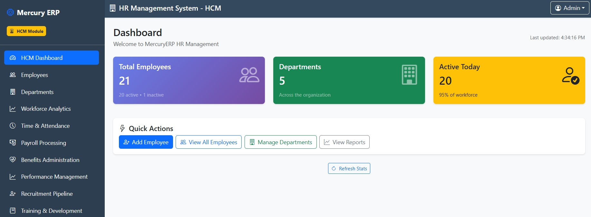
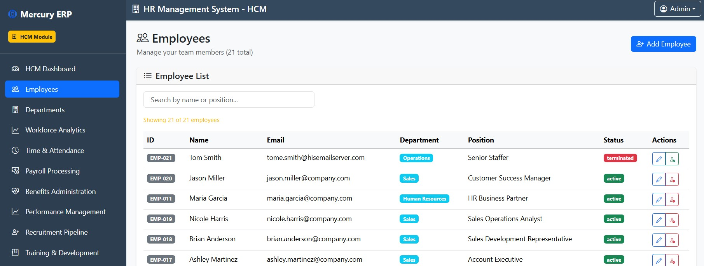
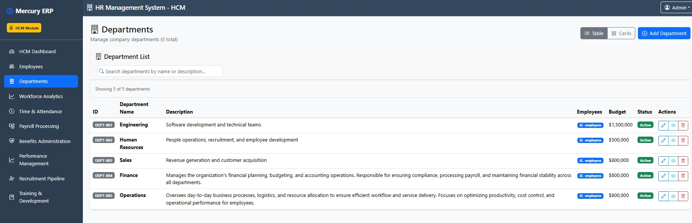

# 🚀 Full-Stack MERN - MercuryERP - Modular HR System

Welcome to the **Full-Stack MERN Mini-Series**!
This project walks through the essentials of building and deploying a MERN stack application step by step — perfect for anyone looking to quickly learn how to take a project from local development to live production.

## 🧩 State of Development

**Current Version:** `v1.5.0`  
**Release Date:** October 9, 2025  
**Release Tag:** `feat: dept-crud`

### 🚀 Features
- update dashboard to show real stats
- Implemented **Employee CRUD** (`b18171e`)
- Added **Employee Filtering** (by name, position, and department)
- Combined backend and frontend query filtering logic
- Enhanced **EmployeeList** component for smoother UX

### 🧭 Upcoming Features
- **Department CRUD** (backend + UI)
- **Add/Update Employee** form integration (UI actions and validations)
- Improved form UX, error handling, and loading indicators


# All Employees


# Filtered Employees per Department

# Departments


1. **Deploying your Node.js/Express Server to Railway**
   Learn how to host your backend API on [Railway](https://railway.app) with ease.

2. **Connecting your MongoDB Atlas Database**
   Set up a managed MongoDB cluster in [MongoDB Atlas](https://www.mongodb.com/atlas/database) and connect it securely to your backend.

3. **Deploying your React Frontend (Netlify/Vercel)**
   Deploy your React frontend to [Netlify](https://www.netlify.com/) or [Vercel](https://vercel.com/) and configure it to communicate with your live backend API.

4. **Employee Filtering Feature (v1.1.0)**
   Added frontend filtering in the EmployeeList component. Users can now search employees by name or position and combine this with department filtering (coming from department page).

   > **Note:** Adding and updating employees will be fully supported in the next release.

---

## 🛠️ Tech Stack

* **MongoDB Atlas** → Cloud database
* **Express.js** → Backend framework
* **React.js** → Frontend library
* **Node.js** → Runtime environment

---

## 📂 Repository Structure

```
mern-mini/
 ├── / root is backend      # Express server + API routes
 ├── frontend/     # React application
 ├── shared/       # (Optional) Shared types/utilities
 └── README.md
```

---

## ⚡ Getting Started (Local Development)

1. **Clone the repository**

   ```bash
   git clone https://github.com/omaraldawud/mern-mini.git
   cd mern-mini
   ```

2. **Install dependencies**

   * Backend:

     ```bash
     cd backend
     npm install
     ```
   * Frontend:

     ```bash
     cd frontend
     npm install
     ```

3. **Run locally**

   * Backend:

     ```bash
     npm run dev
     ```
   * Frontend:

     ```bash
     npm start
     ```

4. **Environment variables**

   * Configure `.env` in both `backend/` and `frontend/` (see `.env.example` if provided).

---

## 🌍 Live Demos

* **Backend (Railway)**: [API Link]() coming soon
* **Frontend (Netlify/Vercel)**: [App Link]() coming soon

> Links will be updated once deployments are live.

---

## 📹 Video Series

* [Video 1: Deploying your Node.js/Express Server to Railway](#)
* [Video 2: Connecting your MongoDB Atlas Database](#)
* [Video 3: Deploying your React Frontend (Netlify/Vercel)](#)

(Links will be added as videos are published.)

---

## 🤝 Contributing

This repository is for educational purposes, but feel free to fork it and adapt it for your own projects.

---

## 📜 License

[MIT](LICENSE) © 2025 Omar Aldawud
